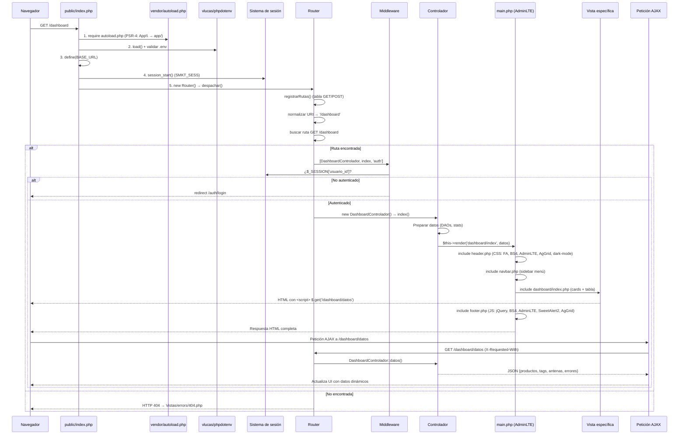
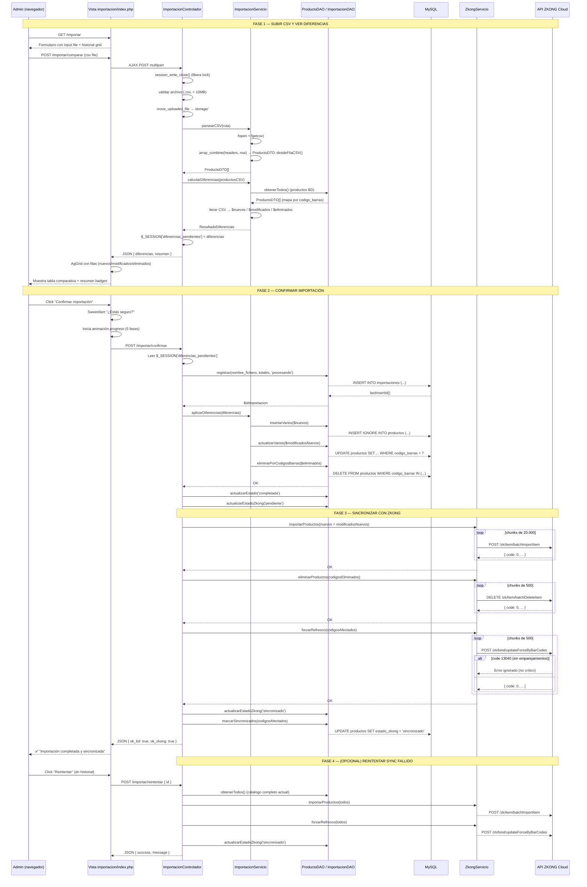

# supermarket-app

Web de gestión de precios para supermercado con etiquetas electrónicas.  
Integración con **ERP** mediante CSV y con el **cloud de etiquetas ZKONG** vía API REST.

---

## Documentación Técnica

### Backend

#### 1. PDO (PHP Data Objects) – Acceso seguro a base de datos
- https://www.php.net/manual/es/book.pdo.php  
- https://phptherightway.com/#databases  

PDO es imprescindible para evitar inyección SQL mediante sentencias preparadas y consultas parametrizadas.

#### 2. Autoloading de clases (PSR-4)
- https://www.php-fig.org/psr/psr-4/  
- https://phptherightway.com/#autocarga_de_clases  

Fundamental para estructurar el proyecto en capas (DAO, DTO, servicios) y evitar `require_once` masivos.

#### 3. Manejo de sesiones en PHP (roles: admin / user)
- https://www.php.net/manual/es/book.session.php  

Necesario para control de permisos y autenticación local (la app gestiona sus propios usuarios).

#### 4. cURL en PHP – Comunicación con APIs (cloud de etiquetas)
- https://www.php.net/manual/es/book.curl.php  

Se utiliza para enviar productos modificados y consultar estado a la **API ZKONG**.

---

### Cloud de etiquetas (API ZKONG)

#### 5. Autenticación RSA + token
- **Obtener clave pública**: `GET /zk/user/getErpPublicKey`
- **Login**: `POST /zk/user/login` con `account`, `password` (encriptada con RSA), `loginType=3`
- **Token** se incluye en header `Authorization: token` para el resto de llamadas.

#### 6. Endpoints principales utilizados en el proyecto

| Funcionalidad                              | Endpoint                         | Método |
|--------------------------------------------|----------------------------------|--------|
| Importar productos por lotes               | `/zk/item/batchImportItem`       | POST   |
| Eliminar productos                         | `/zk/item/batchDeleteItem`       | DELETE |
| Emparejar producto y etiqueta              | `/zk/bind/bindItemPriceTag/1`    | POST   |
| Desemparejar etiquetas                     | `/zk/bind/batchUnbind`           | POST   |
| Forzar actualización (producto modificado) | `/zk/bind/updateForceByBarCodes` | POST   |
| Consultar estado de etiquetas              | `/zk/erp/esl/list`               | POST   |
| Consultar estado de antenas                | `/zk/erp/ap/list`                | POST   |
| Ver logs de operaciones                    | `/zk/erp/log/listLog`            | POST   |

**Nota**: Los parámetros exactos (merchantId, storeId, etc.) se obtienen en el login y se guardan en sesión.

---

### Arquitectura y buenas prácticas

#### 7. Guía completa de buenas prácticas en PHP
- https://phptherightway.com/  

Recurso principal. Define cómo estructurar aplicaciones reales:
- separación de responsabilidades  
- seguridad  
- organización por capas  

#### 8. Buenas prácticas generales en PHP (errores comunes)
- https://www.arsys.es/blog/buenas-practicas-php  

PHP suele generar “código espagueti” si no se aplican estándares adecuados.

#### 9. Estándares PSR (estilo y organización del código)
- https://es.stackoverflow.com/questions/119811/guia-de-estilo-y-buenas-practicas-php  

Uso de PSR-1 y PSR-4 para mantener código consistente y mantenible.

---

### Frontend

#### 10. AdminLTE – Panel de administración (base del proyecto)
- https://adminlte.io/docs/3.2/  

Se utilizará para el dashboard:
- estado de etiquetas  
- estado de antenas  
- métricas de importación  

#### 11. AgGrid – Tablas avanzadas (parte clave del sistema)
- https://www.ag-grid.com/javascript-data-grid/getting-started/  

Uso directo en:
- comparación de CSV  
- listado de etiquetas  
- estado de antenas  

#### 12. SweetAlert2 – Alertas y modales
- https://sweetalert2.github.io/  

Buenas prácticas:
- encapsular en funciones (`mostrarExito`, `confirmarAccion`)  
- no usar `alert()` nativo  

#### 13. jQuery
- https://api.jquery.com/  

Para toda la lógica necesaria entre las **Vistas** y los **Controladores**

---

### CSV (integración con ERP)

#### 14. fgetcsv() – Lectura de CSV
- https://www.php.net/manual/es/function.fgetcsv.php  

El CSV del ERP tiene columnas: `ref`, `idArt`, `nombre`, `pvp`, `cantCaja`, `precioUnidad`, `tipoUnidad`, `pvpOferta`, `pvpTarifa`, `pvpFrio`.  
Se mapea `idArt` a `barCode` en la API ZKONG.

---

### Diseño de código (capas)

#### 15. DTO (Data Transfer Object)
- https://refactoring.guru/es/design-patterns/data-transfer-object  

**Regla**: CSV → DTO → Base de datos → DTO → frontend.  
Cada entidad (Producto, Usuario, Etiqueta) tiene su DTO con propiedades privadas y getters/setters. Sin lógica de negocio ni acceso a BD.

**Errores que evita**:
- uso de claves inexistentes (`$producto['pvp']`)  
- falta de autocompletado  
- mezcla de datos y lógica  

#### 16. DAO (Data Access Object)
Encapsula todas las consultas SQL de una entidad.  
Usa PDO con prepared statements, devuelve DTOs. Sin HTML, sesiones ni lógica de negocio.

**Errores que evita**:
- SQL disperso por controladores/vistas  
- inyección SQL  
- duplicación de consultas  

#### 17. Servicio (Service)
Contiene la lógica de negocio (comparar CSVs, aplicar reglas, comunicarse con API ZKONG).  
No usa `$_POST` ni `$_SESSION`, coordina DAOs, puede lanzar excepciones.

**Errores que evita**:
- controladores gigantes  
- lógica duplicada  
- código no reutilizable  

#### 18. Controlador (Controller)
Punto de entrada de cada petición HTTP.  
Recibe datos, valida, llama a servicios, devuelve vista o JSON. Sin SQL, sin lógica compleja, sin HTML.

**Errores que evita**:
- mezcla de responsabilidades  
- código difícil de mantener  

#### 19. Vista (View)
Presentación de datos. Solo HTML + PHP básico (bucles, condicionales).  
Sin lógica de negocio, sin acceso a BD. Escapar salidas con `htmlspecialchars`.

**Errores que evita**:
- XSS  
- código espagueti  
- dependencias globales  

---

### Comunicación asíncrona (AJAX)

Comunicación asíncrona sin recargar la página.

**Buenas prácticas**:
- usar `async/await`  
- comprobar `response.ok`  
- manejar errores con `try/catch`  
- mostrar mensajes con SweetAlert2  

Se utiliza para:
- emparejar/desemparejar etiquetas sin recargar  
- actualizar tablas AgGrid  
- enviar importaciones de CSV  

---

## Resumen de flujo de datos (actualizado con API ZKONG)

1. **Login local** → sesión con rol (admin/user).
2. **Admin**: sube CSV → se compara con productos en BD local → se muestran diferencias.
3. Al confirmar, se **actualiza BD local** y se **envía al cloud ZKONG**:
   - `batchImportItem` para productos nuevos/modificados.
   - `batchDeleteItem` para productos eliminados.
   - `updateForceByBarCodes` para forzar refresco de etiquetas afectadas.
4. **User**: puede emparejar productos con etiquetas (`bindItemPriceTag`) y consultar estado (`/erp/esl/list`, `/erp/ap/list`).
5. **Dashboard**: obtiene métricas de BD local y del cloud mediante las API de consulta.

---

## Enlaces de interés adicionales

- **PHP OpenSSL** (para encriptar password con RSA): https://www.php.net/manual/es/book.openssl.php  
- **Manejo de JSON en PHP**: https://www.php.net/manual/es/function.json-encode.php  
- **AdminLTE 3 plantillas**: https://adminlte.io/themes/v3/  
- **AgGrid JavaScript grid**: https://www.ag-grid.com/javascript-grid/

---

## Diagrama de flujo de carga (index → autoload → router → adminLTE)



### Flujo textual resumido

```
1. public/index.php
   ├─ vendor/autoload.php          ← Composer PSR-4
   ├─ Dotenv::load()               ← variables de entorno
   ├─ define('BASE_URL', ...)      ← para URLs relativas
   ├─ session_start()              ← SMKT_SESS
   └─ new Router() → despachar()
        │
2. Router::registrarRutas()        ← tabla [método][uri] => [clase, acción, protección]
        │
3. Router::despachar()
   ├─ normalizar URI
   ├─ buscar coincidencia
   │   ├─ no: HTTP 404 → error
   │   └─ sí:
   │       ├─ Middleware::requiereLogin()  ← ¿sesión?
   │       │   └─ falla → redirect /auth/login
   │       ├─ Middleware::requiereAdmin()  ← ¿rol admin? (solo rutas admin)
   │       │   └─ falla → HTTP 403
   │       └─ new Controlador()→acción()
   │            │
4. Controlador::render(vista, datos)
   ├─ extract($datos)              ← $tituloPagina, $paginaActual, etc.
   └─ include main.php             ← layout AdminLTE
        │
5. main.php
   ├─ header.php                   ← <head> (CSS), top navbar, dark mode toggle
   ├─ navbar.php                   ← sidebar con menú
   ├─ <content>                    ← <h1> + include vista específica
   │   └─ vista.php                ← HTML con AgGrid + script AJAX
   └─ footer.php                   ← scripts JS, cierre </body></html>
        │
6. (Opcional) Script en vista      ← $.get('/ruta/datos')
   └─ AJAX → Router → Controlador::acción()
        └─ echo json_encode(...)   ← actualiza AgGrid sin recargar
```

---

## Diagrama de flujo: Importación de productos CSV → ZKONG



### Mapa de campos: CSV → BD → ZKONG

```
CSV columna  → ProductoDTO propiedad → DB columna        → ZKONG campo
────────────────────────────────────────────────────────────────────────
ref          → referencia            → referencia         → productCode
idArt        → codigoBarras          → codigo_barras      → barCode
nombre       → nombre                → nombre             → itemTitle
pvp          → precioVenta           → precio_venta       → price
precioUnidad → precioUnidad          → precio_unidad      → originalPrice
tipoUnidad   → tipoUnidad            → tipo_unidad        → unit
cantCaja     → cantCaja              → cant_caja          → custFeature4
pvpOferta    → precioOferta          → precio_oferta      → custFeature1
pvpTarifa    → precioTarifa          → precio_tarifa      → custFeature2
pvpFrio      → precioFrio            → precio_frio        → custFeature3
```

### Flujo textual detallado

```
FASE 1: SUBIR CSV (POST /importar/comparar)
─────────────────────────────────────────────
1. Admin envía CSV via formulario AJAX
2. ImportacionControlador::comparar()
   ├─ session_write_close()                        ← libera lock
   ├─ validar archivo (.csv, <10MB)
   ├─ move_uploaded_file() → storage/
   ├─ ImportacionServicio::parsearCSV(ruta)
   │   ├─ fopen + fgetcsv(;)
   │   ├─ array_combine(cabeceras, fila)
   │   └─ ProductoDTO::desdeFilaCSV()              ← precio: coma→punto
   ├─ ImportacionServicio::calcularDiferencias(csv)
   │   ├─ ProductoDAO::obtenerTodos()               ← mapa por codigo_barras
   │   ├─ csv vs bd → $nuevos / $modificados / $eliminados
   │   └─ ResultadoDiferencias
   ├─ guardar en $_SESSION['diferencias_pendientes']
   └─ JSON → AgGrid con filas coloreadas (verde/amarillo/rojo)

FASE 2: CONFIRMAR IMPORTACIÓN (POST /importar/confirmar)
──────────────────────────────────────────────────────────
2. Admin confirma → SweetAlert → AJAX
3. ImportacionControlador::confirmar()
   ├─ leer $_SESSION['diferencias_pendientes']
   ├─ ImportacionDAO::registrar()                   ← INSERT importaciones
   │   estado = 'procesando'
   ├─ ImportacionServicio::aplicarDiferencias()
   │   ├─ ProductoDAO::insertarVarios($nuevos)       ← INSERT IGNORE
   │   ├─ ProductoDAO::actualizarVarios($modificados) ← UPDATE
   │   └─ ProductoDAO::eliminarPorCodigosBarras()    ← DELETE IN
   ├─ ImportacionDAO::actualizarEstado('completada')
   └─ ImportacionDAO::actualizarEstadoZkong('pendiente')

FASE 3: SINCRONIZAR CON ZKONG
────────────────────────────────
4. ZkongServicio::importarProductos(nuevos + modificados)
   └─ chunks de 20.000 → POST /zk/item/batchImportItem
5. ZkongServicio::eliminarProductos(eliminados)
   └─ chunks de 500 → DELETE /zk/item/batchDeleteItem
6. ZkongServicio::forzarRefresco(todos los afectados)
   └─ chunks de 500 → POST /zk/bind/updateForceByBarCodes
   └─ error 13040 (sin emparejamientos) se ignora
7. ProductoDAO::marcarSincronizados()
   └─ UPDATE SET estado_zkong = 'sincronizado'
8. ImportacionDAO::actualizarEstadoZkong('sincronizado')
9. JSON → Admin: "Importación completada y sincronizada"

  ⚠ SI ZKONG FALLA:
     → estado_zkong = 'fallido'
     → BD se queda actualizada
     → Admin puede reintentar desde el historial

FASE 4: REINTENTAR SYNC (POST /importar/reintentar)
────────────────────────────────────────────────────
10. Admin click "Reintentar" en historial grid
11. ImportacionControlador::reintentarSincronizacion()
    ├─ ProductoDAO::obtenerTodos()                  ← catálogo completo
    ├─ ZkongServicio::importarProductos(todos)
    ├─ ZkongServicio::forzarRefresco(todos)
    └─ ImportacionDAO::actualizarEstadoZkong('sincronizado')

SYNC INDIVIDUAL (POST /productos/sincronizar-uno)
───────────────────────────────────────────────────
- Desde grid de productos, botón por fila
- ProductoServicio::sincronizarUno()
  ├─ ProductoDAO::obtenerPorCodigoBarras()
  ├─ ZkongServicio::importarProductos([uno])
  ├─ ZkongServicio::forzarRefresco([uno])
  └─ ProductoDAO::marcarSincronizados([uno])

SYNC MASIVO (POST /productos/sincronizar-pendientes)
──────────────────────────────────────────────────────
- Botón "Sincronizar pendientes"
- ProductoServicio::sincronizarPendientes()
  ├─ ProductoDAO::obtenerPendientes()               ← estado_zkong != 'sincronizado'
  ├─ ZkongServicio::importarProductos(pendientes)
  ├─ ZkongServicio::forzarRefresco(pendientes)
  └─ ProductoDAO::marcarSincronizados(pendientes)
```  
